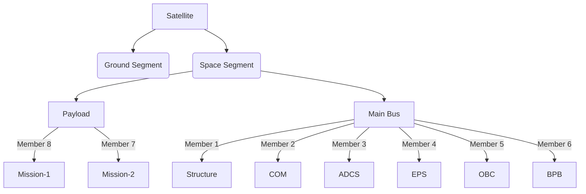

# The BIRDS Bus

The BIRDS (Birds Satellite) Bus is a comprehensive hardware platform designed to meet the needs of CubeSat missions. It provides a standardized framework for integrating key subsystems, enabling teams to focus on mission-specific payloads and objectives. The BIRDS Bus consists of several interconnected boards, each responsible for specific functions such as power management, communication, and data handling. This modular approach simplifies development and ensures reliability for CubeSat missions.

---

## Key Features of the BIRDS Bus
**Modular Design**
The BIRDS Bus is designed with modularity in mind, allowing teams to easily integrate and replace subsystems as needed. This flexibility is particularly useful for CubeSat missions with varying requirements.

**Proven Reliability**
The BIRDS Bus has been used in multiple missions, including BIRDS3 and BIRDS4, demonstrating its reliability and effectiveness in space.

**Open-Source Documentation**
The BIRDS Project provides extensive documentation, including schematics, firmware, and interface control documents (ICDs), to support teams in implementing the bus. The general documentation can be found here.

---

## What is in the BIRDS Bus?

The BIRDS Bus includes the following key components:

  
&nbsp;
  

### [On-Board Computer (OBC)]({{site.url}}/overview/birds/obc-page.html)
The OBC is the brain of the satellite, handling core computing tasks such as command execution, data management, and subsystem coordination. It uses a PIC microcontroller for reliable and efficient operation.

### [Electrical Power System (EPS)]({{site.url}}/overview/birds/fab-page.html)
The EPS manages power generation, storage, and distribution. It ensures that all subsystems receive adequate power and that the battery is charged efficiently. The main board that drives this is the FAB on a 1U and 2U configuration and the EPS board on a 3U+ confuguration. the [Rear Access Board (RAB)]({{site.url}}/overview/birds/rab-page.html) and the [Solar Panel board]({{site.url}}/overview/birds/solar-page.html) are also a part of this system in the BIRDS Bus. 

### Attitude Determination and Control System (ADCS)
The ADCS controls the satellite's orientation and stability, ensuring that it maintains the correct position for mission operations.

### [Communications (COM)]({{site.url}}/overview/birds/com-page.html)
The COM subsystem oversees data transmission to and from the satellite. It uses UHF/VHF communication for reliable telemetry and command handling. The [antenna board]({{site.url}}/overview/birds/antenna-page.html) carries the COM, APRS and GPS antennas as well as their release mechanism.

  
  

    
  
  

### **Structure**
The structure provides the physical framework for the satellite, ensuring durability and protection for all subsystems.

  
&nbsp;
  

### **Payload**
The payload includes mission-specific instruments or sensors, enabling the satellite to perform its primary objectives.

### [Backplane Board (BPB)]({{site.url}}/overview/birds/bpb-page.html)
The BPB integrates all subsystems, allowing the transfer of power and data between them. It serves as the central hub for the satellite's electrical and data connections.

         
  

    
  

## [Ground Station Software]({{site.url}}/overview/birds/GS-software.html).
The BIRDS Project provides ground station software for communicating with the satellite. Documentation and links to the software can be found here.

## [General documentation](https://github.com/BIRDSOpenSource/BIRDS-GeneralDocumentation):
While this website does contain information regarding the program and the BIRDSBus, the main explanations and documentation is contained in the Program Textbook and the Interface Control Document.

---

## Organizational Chart

## See also
- [Basic Concepts and Processes for First-Time CubeSat Developers](https://www3.nasa.gov/sites/default/files/atoms/files/nasa_csli_cubesat_101_508.pdf)
- [1U – 12U CubeSat Design Specifications](https://www3.nasa.gov/sites/default/files/atoms/files/cubesatdesignspecificationrev14_12022-02-09.pdf)

[Previous]({{site.url}}/about/){: .btn .btn-purple }
[Next]({{site.url}}/overview/birds/obc-page){: .btn}