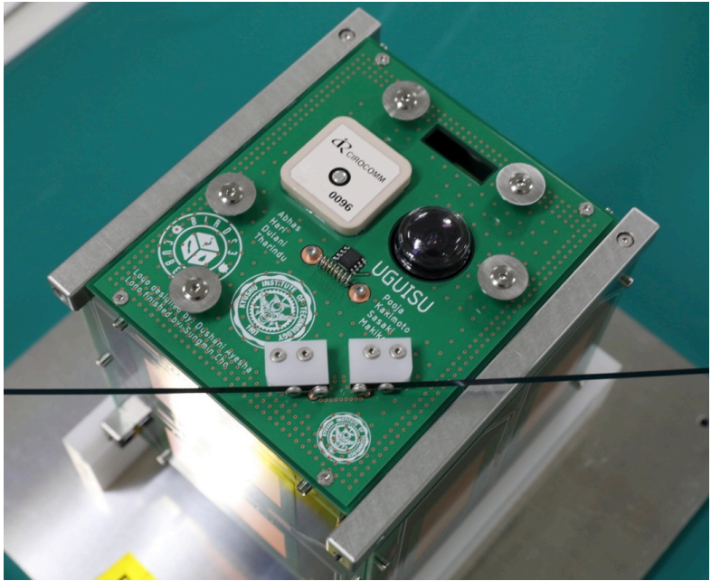

## Antenna Board

The antenna board carries both the communication antennas as well as the GPS antenna. The comms antenna is a tape antenna, folded in a ring and held in place by a resistor heater and string. At the time of deployment, this antenna springs open and starts to function. The GPS Antenna is a simple ceramic antenna, no release mechanism required.

The documentation for this board can be found [***here***](https://github.com/BIRDSOpenSource/BIRDS3-AntennaPanel).

[Back](./)
