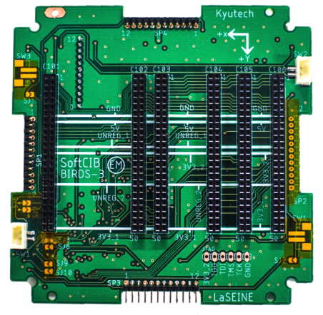
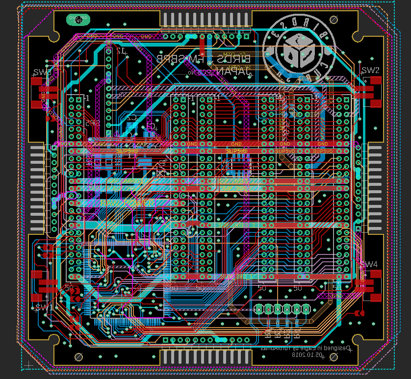

## Backplane Board
###HBPB (Backplane without CPLD):

###SBPB (Backplane with CPLD):

This is the backplane board used in BIRDS 3 and 4. As previously mentioned, this board's function is to connect all the other boards, including the mission ones, together. Specifically, the board in the first picture is the one without CPLD which is used to redirect connections when needed. HBPB is the board without CPLD. SBPB has CPLD.

The repository can be found [***here***](https://github.com/BIRDSOpenSource/BIRDS3-BPB)

[back](./)
