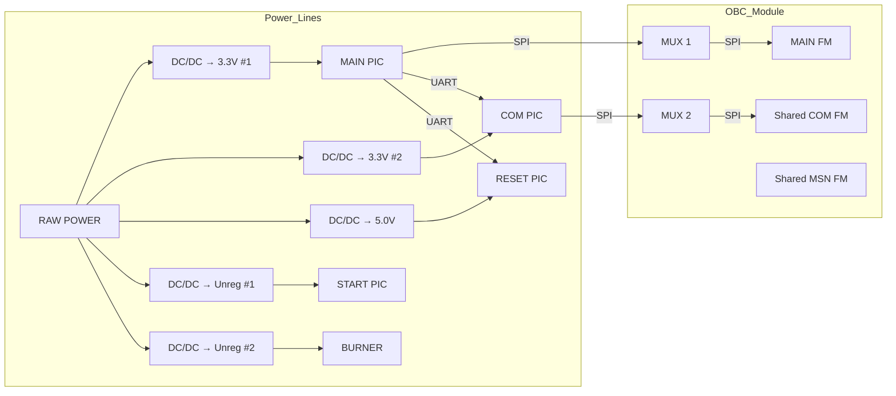

# EPS Hardware

# Guide to the Electrical Power System (EPS) on the BIRDS Platform

{: .no\_toc }

**Estimated time to complete:** 7 minutes
{: .label}

This guide provides practical insights and frequently asked questions (FAQs) related to the **Electrical Power System (EPS)** used in the BIRDS satellite platform. It is aimed at new EPS team members who are onboarding or seeking clarity on implementation and testing practices.

---

Table of Contents

* [System Overview](#system-overview)
* [Power Line Configuration](#power-line-configuration)
* [Fuse Configurations and LED Indicators](#fuse-configurations-and-led-indicators)
* [Testing and Debugging Practices](#testing-and-debugging-practices)
* [Sensor Behavior and I/O Behavior](#sensor-behavior-and-io-behavior)
* [Tips from Past Missions](#tips-from-past-missions)
* [Additional Q\&A](#additional-qa)

---

## System Overview

The EPS module is central to distributing regulated power to all satellite subsystems. It includes multiple **DC-DC converters**, **fuses**, **analog-digital converters (ADCs)**, and **microcontrollers** that help manage power delivery and monitoring.

EPS typically interfaces with four microcontrollers (PICs):

* **MAIN PIC** — core controller
* **COM PIC** — communications controller
* **RESET PIC** — responsible for satellite resets
* **START PIC** — used at startup
* Other components include: **burn wires**, **MUXes**, **shared flash memories**, and **external interfaces (e.g., UART, SPI)**

---

## Power Line Configuration

The diagram above illustrates how **RAW power** is distributed to different voltage rails and used to power various microcontrollers and functional blocks.

---

## Fuse Configurations and LED Indicators

* **Fuses** are placed on each regulated power line to prevent damage during overcurrent conditions.
* The **LED indicators** next to each fuse are useful for visually identifying which lines are live or broken.
* Use a **multimeter in continuity mode** to test fuses and trace broken power lines.
* Fuses are surface-mounted; replacement or bridging should be done cautiously.

---

## Testing and Debugging Practices

### Using External Power Supplies

* During board-level testing, it is often better to use **bench power supplies** with current limiting features instead of satellite batteries.
* Apply power to the `RAW` or `VBAT` pin with a regulated 8–12 V source.

### Ground Station Test Environment

* Ground Station programs are often developed using **Visual Studio Community** (free). The paid **Professional version** is not required.

### RF Shielding for Command Testing

* In some cases, a metal (aluminum) box is used to shield antennas during integration testing to simulate realistic RF conditions.

---

## Sensor Behavior and I/O Behavior

### Battery Temperature Sensor Behavior

* The **temperature sensor** in the battery box outputs a voltage that **decreases with increasing temperature**.
* The **heater control** works such that:

  * `RD0 = 1` → heater ON
  * `RD0 = 0` → heater OFF

### Signal Interrupts on the FAB

* For signals like `DEPSW4` that seem interrupted at connectors like `J15`, this is **intentional by design**.
* In many cases, **jumper pins or manual soldering** are added post-fabrication for continuity.

---

## Tips from Past Missions

### Communication Between COM PIC and Reset PIC

Although the **circuit diagram** shows a UART connection between COM PIC and Reset PIC, this is not functionally implemented in the firmware.

* The UART connection exists on the schematic for **debugging and flexibility**, but was not needed for the flight version.
* `RB6` and `RB7` on the Reset PIC are reserved for UART during development to send data directly to a PC for debugging, bypassing the Main PIC.

### Software Update Limitations

> **How were software updates and patches handled for BIRDS satellites after launch?**
> *Software updates were not possible after launch due to hardware constraints. Therefore, robust testing was performed before launch to reduce the risk of in-orbit issues.*

---

## Additional Q&A

We continue to update this guide as new experiences are gained across missions.

If you have additional questions, please contact your EPS mentor or refer to the EPS debug manual.

