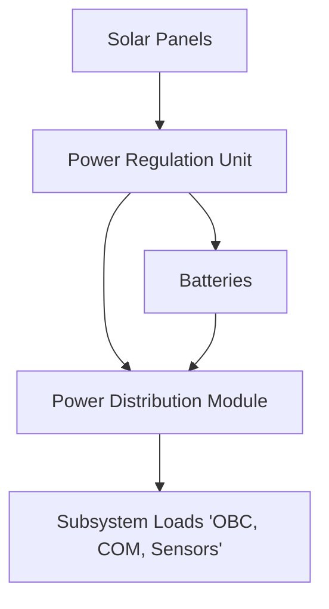

# Guide for EPS Team Members
{: .no_toc }

Table of Contents

- Table of Contents
{:toc}

## Introduction
{: .no_toc }

The Electrical Power System (EPS) team is responsible for ensuring that the satellite has a reliable and efficient power supply throughout its mission. This includes harvesting energy from solar panels, regulating voltage levels, managing power storage in batteries, distributing power to subsystems, and protecting the system from faults or power failures.

In a CubeSat like those in the BIRDS program, where volume and efficiency are highly constrained, the EPS team's design and implementation decisions are mission-critical.

---

## Role and Responsibilities of the EPS Team
{:toc}

- Design and simulate the EPS architecture of the satellite
- Select and size solar panels and batteries
- Implement power distribution and regulation circuitry
- Define and monitor the satellite’s power budget
- Ensure reliable startup, shutdown, and protection mechanisms
- Conduct hardware-in-the-loop tests and system validation
- Collaborate with other subsystem teams (OBC, COM, ADCS, etc.)
- Maintain documentation and track design iterations

---

## Overview of Satellite EPS Architecture
{:toc}

The typical EPS architecture includes:
- Power Generation: Solar panels collect solar energy.
- Regulation: Power is regulated and conditioned to acceptable levels.
- Storage: Batteries store excess energy for eclipse periods.
- Distribution: Power is distributed to all satellite subsystems.
- Monitoring: Voltage, current, and temperature data are tracked.

## Power Generation
{:toc}

- Use triple-junction GaAs solar cells (e.g., AzurSpace 3G30) for high-efficiency conversion
- Mount panels on exposed faces of the CubeSat
- Design circuits to handle varying illumination and eclipse periods
- Track expected input under different orbital conditions

🛠 Tip: Simulate orbital lighting conditions with tools like STK or FreeFlyer for realistic input estimates.

## Power Storage
{:toc}
- Lithium-ion or Li-Po batteries are most common
- Battery configuration depends on mission duration, peak load demand, and charging cycles
- Battery Management Systems (BMS) should monitor:
    - State of Charge (SoC)
    - Temperature
    - Cell balancing
    - Over-voltage/under-voltage protection

⚠️ Use aerospace-rated batteries or test COTS batteries extensively.

## Power Regulation and Distribution
{:toc}
- Use DC-DC converters to stabilize voltage to required levels (e.g., 3.3V, 5V)
- Use OR-ing diodes or ideal diode controllers for multiple power paths
- Implement load switches or power MOSFETs for controlled distribution
- Add current-limiting resistors or protection ICs

🔋 Common Chips: TPS54202, LTC4412, PTH04070, or LM2940

## Power Budgeting and Management
{:toc}

| Subsystem | Avg Power (mW) | Peak Power (mW) | Duty Cycle (%) |
| --------- | -------------- | --------------- | -------------- |
| OBC       | 300            | 500             | 80             |
| COM       | 200            | 400             | 50             |
| EPS       | 100            | 150             | 100            |
| Payload   | 500            | 1000            | 20             |

**Total Avg Power**: ~550 mW

**Total Peak Power**: ~2W

Steps:
1. Estimate average and peak loads per subsystem
2. Factor in orbital day/night cycles
3. Account for degradation in solar efficiency over time
4. Include 10–20% margin in design

## Fault Detection, Isolation, and Recovery (FDIR)
{:toc}

- Monitor telemetry: voltages, currents, temps, battery SoC
- Detect anomalies like:
    - Overcurrent in a subsystem
    - Battery overheating
    - Solar panel failure
- Implement automatic isolation:
    - Switch off faulty load
    - Re-route power
- Log fault events to ground station

🧠 Recovery Modes:
- EPS-safe mode: power only essential systems
- Watchdog resets for microcontrollers
- Redundant charging paths

## Testing and Validation
{:toc}

Key tests before launch:
- Load testing with electronic loads
- Thermal cycling of batteries and regulators
- Overcurrent and short-circuit protection validation
- Integration testing with OBC and COM systems
- Vacuum and vibration tests

🧪 Document all test configurations, input data, and results.

## Documentation and Version Control
{:toc}

- Use the [project Git repository] for all schematics and PCB layouts
- Maintain:
    - EPS block diagrams
    - Solar and battery specs
    - Test plans and reports
    - BOMs (Bill of Materials)
- Tag stable hardware versions in Git using vX.Y tags

✅ All changes should go through peer review.

## Tools and Resources for EPS Teams
{:toc}

Tools and Resources for EPS Teams: 
- Eagle / Fusion360: PCB design and schematics
- LTspice / TINA-TI/ Proteus: Circuit simulation
- Google Sheets/ Microsoft Excel: Power budgeting calculators
- Python Scripts: For telemetry parsing and visualization
- Documentation Templates: Use our [EPS doc template]

## Recent Updates
Battery Testing and Screening Procedures: Detailed procedures for battery testing and screening have been added to the procedures repository. Please check these new documents for updated guidelines.

[Previous]({{site.url}}/about/){: .btn .btn-purple }
[Next]({{site.url}}/overview/birds/obc-page){: .btn}

[project Git repository](https://github.com/BIRDSOpenSource/BIRDS4-FAB)
[EPS doc template]({{site.url}}/resources/templates/eps)