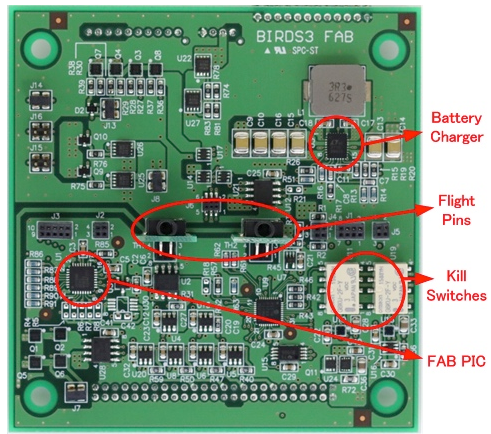

## Forward Access Board

The Foward Access Board (FAB) has two main functions. It is part of the Electrical Power System (EPS), collecting and monitoring electrical power information and managing a kill switch, but not controlling the regulators. That is done by the OBC. Also, it contains the external interfaces, such as the remove before flight pins and programming ports. This board is of proprietary design by Sagami Tsushin. As such, only the schematic for this board is included in this documentation, in PDF format.

The repository can be found [***here***](https://github.com/BIRDSOpenSource/BIRDS3-FAB)

[back](./)
