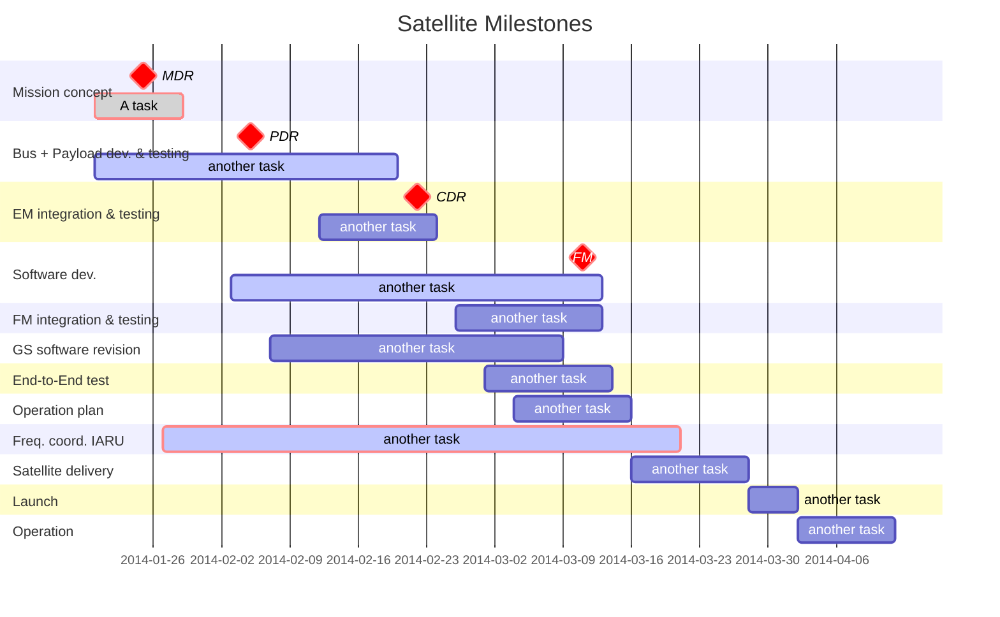
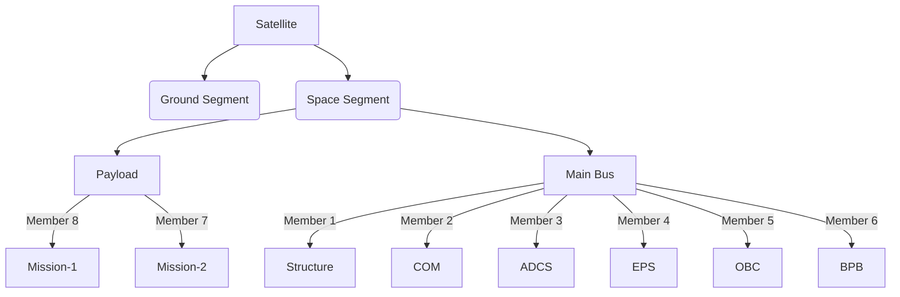

# **BIRDS Open Source: Begin your satellite development**  
{: .text-purple-200 .lh-tight}  

BIRDS Open Source offers a library of resources to guide your satellite mission from start to finish, with workflows and open-source tools you can trust.

**The BIRDS Open Source includes the following:**  
- **Software Catalog:** Allows you to manage all your software in one place including microservices, libraries and data pipelines.
- **Software Templates:** Quickly start projects and standardize tools with best practices  
- **TechDocs:** Easily create and maintain technical documentation using a "docs like code" approach  

---
## Benefits of the BIRDS Open Source

* **For engineering managers:** It simplifies the process of maintaining standards and managing your interconnected tech network.
* **For developers:** The BIRDS Open Source provides a central place to manage all projects, which ease the building of standardized software components.
* **For platform engineers:** It allows for seamless integration of new tools and extends functionality.  
* **For Everyone:** It serves as a single and consistent experience that ties all your resources and tools together.

---
## **Explore the BIRDS Series**  
{: .lh-tight}  

  

The Joint Global Multi-Nations Birds Satellite project, or BIRDS project for short, was established by the Kyushu Institute of Technology ([Kyutech](https://www.kyutech.ac.jp/english/)) to help countries build their first satellite. Young engineers from select countries get to learn about space engineering at Kyutech, mostly using the 1U CubeSat.  

The BIRDS project has two main objectives:

1. Experience the entire cycle of a satellite project, from mission definition to operation, in a hands-on manner.
2. Have a strategy for sustainability after the training.

The primary goal is not to build a satellite, but to establish a sustainable space program in each member country.   

So far, there have been 4 completed and one ongoing BIRDS missions, which are:
1. BIRDS-1: Bangladesh, Japan, Mongolia, Ghana and Nigeria  .
2. BIRDS-2: Bhutan, Philippines and Malaysia.
3. BIRDS-3: Japan, Sri Lanka and Nepal.  
4. BIRDS-4: Japan, Philippines and Paraguay.  
5. BIRDS-5: Japan, Uganda and Zimbabwe.   


Kyutech's fellowship programs (PNST) and Space Engineering International Course (SEIC) provide hands-on space engineering training using CubeSat development, enabling each mission to be completed in two years. The goal of open sourcing the process is to enable teams from across the world to develop their own countries' first satellites.

### Documentation Team  

This documentation has been developed and managed by various team members of Kyutech BIRDS program. [Find out more here]({{site.url}}/overview/birds/teams.html).

---
[Next Page:  More on BIRDS Bus]({{site.url}}/overview/birds/bus-page){: .btn .btn-purple}                                               [Go To:  Get Started Now]({{site.url}}/get-started){: .btn .btn-purple}  

---


# Getting Started
To ensure a smooth journey in building your CubeSat, there are a few things you'll want to understand beforehand. This section outlines key knowledge areas you'll need, from using the platform and GitHub to understanding systems engineering principles.

---

## Platform Basics: GitHub and Git
To work with BIRDS, you'll need a GitHub account. This is where you'll manage your codebase and contribute to open-source satellite projects. Here’s a quick guide to get you started:

### 1. **GitHub Account**
   - Create a [GitHub account](https://github.com/) to access repositories, contribute to projects, and manage your code.
   - Familiarize yourself with the platform’s layout, including repositories, commits, pull requests, and issues.

### 2. **Using Git**
   - **Git** is a version control system used to manage and track changes in your codebase.
   - Learn how to use basic Git commands like:
     - `git clone` – To download repositories.
     - `git pull` – To update your local copy with the latest changes.
     - `git commit` – To save your changes locally.
     - `git push` – To upload your changes to GitHub.

### 3. **Cloning a Repository**
   - To start working on a project, you’ll first need to **clone** the relevant repository from GitHub to your local machine:
     ```bash
     git clone https://github.com/username/repository.git
     ```
   - Once cloned, you can make changes to the files locally and push them back to the repository when you’re ready.

---

## Systems Engineering Approach
Building a satellite involves complex systems that need careful planning and integration. Here are some key concepts of systems engineering that will guide your CubeSat development:

### 1. **Understanding Systems Engineering**
   - Systems engineering is the interdisciplinary approach to designing and managing complex systems.
   - It focuses on understanding the entire system, from design and development to testing and operation, ensuring that all parts work together to meet the mission goals.

### 2. **Defining Requirements**
   - Start by defining your satellite’s mission and operational goals.
   - Understand the system's constraints, such as size, weight, power, and budget, and define technical requirements to meet them.

### 3. **Subsystems Integration**
   - Satellites consist of multiple subsystems such as power, communication, and attitude control. Systems engineering ensures that all subsystems integrate seamlessly.
   - Learn how these subsystems interact and contribute to the overall mission’s success.

### 4. **Risk Management**
   - Identify potential risks early in the development process and implement strategies to mitigate them.
   - Regular testing, reviews, and simulations help identify weak points and prevent system failures.

---

##  What are the phases of a satellite?
  The development and deployment of a satellite involve a series of carefully structured phases to ensure the mission's success. From initial concept discussions to final pre-launch verifications, these phases guide teams through designing, building, and testing the satellite to meet stringent space industry standards. 
    
  Each phase acts as a checkpoint to confirm that requirements are met and potential risks are mitigated. Understanding the phases - including the
  - [Mission Definition Review (MDR)], 
  - [Preliminary Design Review (PDR)], 
  - [Critical Design Review (CDR)], and 
  - [Flight Readiness Review (FRR)] 



These phases create a structured pathway from conceptualization to launch, with each review and testing stage serving as a critical checkpoint. The **MDR** sets the scope, the **PDR** checks the initial design feasibility, the **CDR** finalizes the detailed design, and **FRR** ensures that the satellite is robust and mission-ready. This structured approach helps in mitigating risks, ensuring quality, and promoting mission success.

## **3. What tools do we use in development?**
   - **Software**:
     - **Computer Aided Design (CAD) tools for Design**: Fusion 360
     - **Simulation Tools**: Thermal desktop, STK for mission analysis
     - **Programming Languages**: C/C++, Python 
     - **Programming Environment**: CCS Compiler, MPLAB IDE
     - **Communication Protocols**: UART, SPI
   - **Hardware**:
     - **Microcontrollers/Boards**: PIC MCUs, custom PCBs
     - **Power Systems**: Solar panels, battery packs
     - **Sensing Devices**: Magnetometers, gyroscopes for ADCS
   - **Version Control**: Git/ [GitHub] 


With this foundational knowledge, you’ll be better equipped to dive into the satellite-building process. The next step is to select the path that best fits your experience level and start building!


---
title: BIRDS Bus
parent: What is BIRDS?
nav_order: 1
grand_parent: Getting Started
layout: default
lang: en
---

# The BIRDS Bus

The BIRDS (Birds Satellite) Bus is a comprehensive hardware platform designed to meet the needs of CubeSat missions. It provides a standardized framework for integrating key subsystems, enabling teams to focus on mission-specific payloads and objectives. The BIRDS Bus consists of several interconnected boards, each responsible for specific functions such as power management, communication, and data handling. This modular approach simplifies development and ensures reliability for CubeSat missions.

---

## What is in the BIRDS Bus?

The BIRDS Bus includes the following key components:

<p>
  
&nbsp;
  
</p>


### [On-Board Computer (OBC)]({{site.url}}/overview/birds/obc-page.html)
The OBC is the brain of the satellite, handling core computing tasks such as command execution, data management, and subsystem coordination. It uses a PIC microcontroller for reliable and efficient operation.

### [Electrical Power System (EPS)]({{site.url}}/overview/birds/fab-page.html)
The EPS manages power generation, storage, and distribution. It ensures that all subsystems receive adequate power and that the battery is charged efficiently. The main board that drives this is the FAB on a 1U and 2U configuration and the EPS board on a 3U+ confuguration. the [Rear Access Board (RAB)]({{site.url}}/overview/birds/rab-page.html) and the [Solar Panel board]({{site.url}}/overview/birds/solar-page.html) are also a part of this system in the BIRDS Bus. 

### Attitude Determination and Control System (ADCS)
The ADCS controls the satellite's orientation and stability, ensuring that it maintains the correct position for mission operations.

### [Communications (COM)]({{site.url}}/overview/birds/com-page.html)
The COM subsystem oversees data transmission to and from the satellite. It uses UHF/VHF communication for reliable telemetry and command handling. The [antenna board]({{site.url}}/overview/birds/antenna-page.html) carries the COM, APRS and GPS antennas as well as their release mechanism.

<center>  
  <p>
    
  </p>  
</center>

### **Structure**
The structure provides the physical framework for the satellite, ensuring durability and protection for all subsystems.
<p>
  
&nbsp;
  
</p>

### **Payload**
The payload includes mission-specific instruments or sensors, enabling the satellite to perform its primary objectives.

### [Backplane Board (BPB)]({{site.url}}/overview/birds/bpb-page.html)
The BPB integrates all subsystems, allowing the transfer of power and data between them. It serves as the central hub for the satellite's electrical and data connections.
<center>         
  <p>
    
  </p>
</center>

---

## Organizational Chart



## Key Features of the BIRDS Bus**
**Modular Design**
The BIRDS Bus is designed with modularity in mind, allowing teams to easily integrate and replace subsystems as needed. This flexibility is particularly useful for CubeSat missions with varying requirements.

**Proven Reliability**
The BIRDS Bus has been used in multiple missions, including BIRDS3 and BIRDS4, demonstrating its reliability and effectiveness in space.

**Open-Source Documentation**
The BIRDS Project provides extensive documentation, including schematics, firmware, and interface control documents (ICDs), to support teams in implementing the bus. The general documentation can be found here.

## 3D Models and CAD Files
The 3D models for the BIRDS3 and BIRDS4 buses, as well as the stand, are available for download:

BIRDS3 CAD Models: [Download here](https://github.com/BIRDSOpenSource/BIRDS3-CAD)

BIRDS4 CAD Models: [Download here](https://github.com/BIRDSOpenSource/BIRDS4-CAD)

## [Ground Station Software]({{site.url}}/overview/birds/GS-software.html).
The BIRDS Project provides ground station software for communicating with the satellite. Documentation and links to the software can be found here.

## Recent Updates
Radiometrix HX1 COMS Module: A team presented their use of the Radiometrix HX1 communication module with the BIRDS platform during the March 2022 BIRDS meeting. The module's datasheet has been added to the COMS repositories.

Battery Testing and Screening Procedures: Detailed procedures for battery testing and screening have been added to the procedures repository. Please check these new documents for updated guidelines.

## [General documentation](https://github.com/BIRDSOpenSource/BIRDS-GeneralDocumentation):
While this website does contain information regarding the program and the BIRDSBus, the main explanations and documentation is contained in the Program Textbook and the Interface Control Document.


## See also
- [ Basic Concepts and Processes for First-Time CubeSat Developers](https://www3.nasa.gov/sites/default/files/atoms/files/nasa_csli_cubesat_101_508.pdf)
- [1U – 12U CubeSat Design Specifications](https://www3.nasa.gov/sites/default/files/atoms/files/cubesatdesignspecificationrev14_12022-02-09.pdf)


[Previous]({{site.url}}/about/){: .btn .btn-purple }
[Next]({{site.url}}/overview/birds/obc-page){: .btn}

## Other resources
- [Engineer Me This](https://www.youtube.com/@EngineerMeThis/videos)
- [Build A Cubesat](https://www.youtube.com/@buildacubesat)
- [RG Sat](https://www.youtube.com/@RGSAT)
- [Kyutech SEIC](https://www.youtube.com/@kyutechseic4187)

[GitHub Issues.]: https://github.com/BIRDSOpenSource/Build-A-Satellite/issues
[GitHub]: https://github.com/BIRDSOpenSource
[our Discussions channel on Github]: https://github.com/orgs/BIRDSOpenSource/discussions/categories/ideas
[BIRDS]: https://birds-project.com/
[get in touch with us.]: info@kyutech-laseine.net
[Mission Definition Review (MDR)]: {{site.url}}/project-managers/milestones/pm-mdr.html
[Preliminary Design Review (PDR)]: {{site.url}}/project-managers/milestones/pm-pdr.html
[Critical Design Review (CDR)]: {{site.url}}/project-managers/milestones/pm-cdr.html
[Flight Readiness Review (FRR)]: {{site.url}}/project-managers/milestones/pm-frr.html


[Previous]({{site.url}}/get-started){: .btn .btn-purple }
[Next]({{site.url}}/get-started/reference.html){: .btn}
