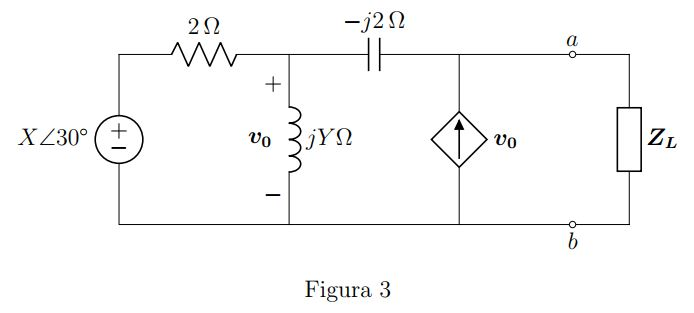

# Delta Lab
Is a research laboratory located at the Electromechanical Engineering Faculty at Tecnológico de Costa Rica, Cartago Campus. Its objective is to provide a space where researchers from Tecnológico de Costa Rica can work on their projects within a multidisciplinary environment.

Fields currently being worked on include IoT, Industry 4.0, Automation, Additive Manufacturing, Plasma and Material Sciences.

## Active projects:
### Three-phase compressor monitoring and cloud uploading firmware with ESP32 (Erick Quirós Gómez)
Falta la descripción
[_More information_](./another-page.html)
### LoRa based control and logging IoT system for acueduct ASADA-Sámara (Sergio Solórzano Alfaro)

This project presents the implementation of Internet of Things (IoT) technologies as a key tool in the compilation of water data that will be input for the management of water resources for the main aqueduct of ASADA. The intercommunication of Arad Octave hydro metering devices, liquid level sensors on main tank and the electrical control for pump station was proposed, through the use of a LoRaWAN network and the MQTT communication protocol for remote operation and data publication on the IoT Adafruit IO platform.

[_More information_](./ProyectoSergio.html)
### ESP32 based embedded logger and cloud uploader for wind turbine efficiency data for LIENE (Nestor Martinez Soto)
Development of a low-cost system for wind turbine efficiency data gathering and logging. It shall allow the Wind Energy Research Lab (LIENE) log and visualize operation data, which increases it's capabilities for future projects.
[_More information_](./ProyectoNestor.html)
### Modification of a CubePro Trio to implement a Duet Wifi 2 and Dyzedesign extruders (Jairo Rodríguez Blanco & Jeroen van Hoof Gómez)
Falta la descripción
[_More information_](./another-page.html)
### Modular support structure for superconductor coils | Phase II (Carlos Otárola Zúñiga)
Falta la descripción
[_More information_](./another-page.html)
### Acetona Maite
Falta la descripción
[_More information_](./another-page.html)

## Members
### Faculty

|                   |                    |
| :-----------:                                     | :-----------:                                         |
| M Eng. Carlos Otárola Zúñiga                      | PhD. Eng. Juan José Rojas Hernández                   |
| Coordinator                                       | Researcher                                            |
| _Modern Manufacturing_                            | _Power Systems and IoT_                               |
| [cotarola@tec.ac.cr](mailto:cotarola@tec.ac.cr)   | [juan.rojas@tec.ac.cr](mailto:juan.rojas@tec.ac.cr)   |

### Assistants

| Name                              | Degree                            | Email                     |
|:-------------                     |:------------------                |:------                    |
| Jairo Rodríguez Blanco            | Mecatronics Engineering           | jairo.rb8@estudiantec.cr  |
| Sergio Solórzano Alfaro           | Industrial Maintenance Engineering| solorzanos117@gmail.com   |
| Erick Quirós Gómez                | Industrial Maintenance Engineering| erickquigo@estudiantec.cr |
| Nestor Martínez Soto              | Industrial Maintenance Engineering| nesmar@estudiantec.cr     |
| Jervis Villalobos Villegas        | Mechatronics Engineering          |                           |

Text can be **bold**, _italic_, or ~~strikethrough~~.

[Link to another page](./another-page.html).

There should be whitespace between paragraphs.

There should be whitespace between paragraphs. We recommend including a README, or a file with information about your project.

# Header 1

This is a normal paragraph following a header. GitHub is a code hosting platform for version control and collaboration. It lets you and others work together on projects from anywhere.

## Header 2

> This is a blockquote following a header.
>
> When something is important enough, you do it even if the odds are not in your favor.

### Header 3

```js
// Javascript code with syntax highlighting.
var fun = function lang(l) {
  dateformat.i18n = require('./lang/' + l)
  return true;
}
```

```ruby
# Ruby code with syntax highlighting
GitHubPages::Dependencies.gems.each do |gem, version|
  s.add_dependency(gem, "= #{version}")
end
```

#### Header 4

*   This is an unordered list following a header.
*   This is an unordered list following a header.
*   This is an unordered list following a header.

##### Header 5

1.  This is an ordered list following a header.
2.  This is an ordered list following a header.
3.  This is an ordered list following a header.

###### Header 6

| head1        | head two          | three |
|:-------------|:------------------|:------|
| ok           | good swedish fish | nice  |
| out of stock | good and plenty   | nice  |
| ok           | good `oreos`      | hmm   |
| ok           | good `zoute` drop | yumm  |

### There's a horizontal rule below this.

* * *

### Here is an unordered list:

*   Item foo
*   Item bar
*   Item baz
*   Item zip

### And an ordered list:

1.  Item one
1.  Item two
1.  Item three
1.  Item four

### And a nested list:

- level 1 item
  - level 2 item
  - level 2 item
    - level 3 item
    - level 3 item
- level 1 item
  - level 2 item
  - level 2 item
  - level 2 item
- level 1 item
  - level 2 item
  - level 2 item
- level 1 item

### Small image


### Large image


### Image hosted in this repo

.


### Definition lists can be used with HTML syntax.

<dl>
<dt>Name</dt>
<dd>Godzilla</dd>
<dt>Born</dt>
<dd>1952</dd>
<dt>Birthplace</dt>
<dd>Japan</dd>
<dt>Color</dt>
<dd>Green</dd>
</dl>

```
Long, single-line code blocks should not wrap. They should horizontally scroll if they are too long. This line should be long enough to demonstrate this.
```

```
The final element.
```
