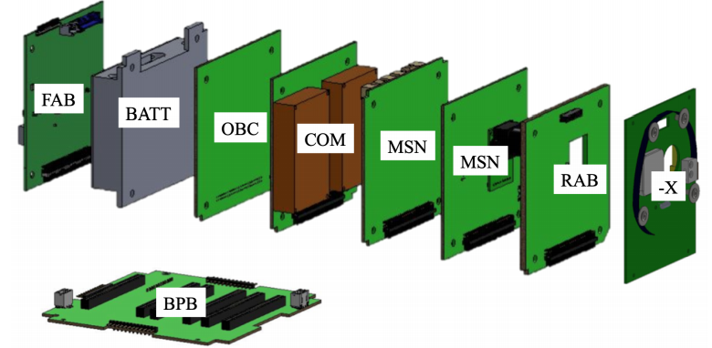

# BIRDS Project
The Joint Global Multi-Nations Birds Satellite project, or BIRDS project, was created by the Kyushu Institute of Technology ([_KyuTech_](https://www.kyutech.ac.jp/english/)) to help countries build their first satellite. So far, there have been 4 BIRDS generations completed:

1. BIRDS-1: Bangladesh, Japan, Mongolia, Ghana and Nigeria.
2. BIRDS-2: Buthan, The Philipines and Malaysia.
3. BIRDS-3: Japan, Sri Lanka and Nepal
4. BIRDS-4: Japan, The Philipines, Paraguay.

And there is a new generation currently in development, BIRDS-5, with Japan, Uganda and Zimbabwe being the participating countries.

The project itself has to main driving points:

1. Experience the entire cycle of a satellite project, from mission definition to operation, in a hands-on manner.
2. Have a strategy for sustainability after the training ends.

It should be emphasized that the primary goal is not the building of a satellite, but to have a long-term and sustainable space program established in each member country.

Kyutech initiated a long-term fellowship program, DNST/PNST (Doctorate in NanoSatellite Technology/ Postgraduate study in NanoSatellite Technology), in 2011 in collaboration with the United Nations Office of Outer Space Affairs (UNOOSA) to promote the space capacity building of non-space-faring nations. It also started the Space Engineering International Course (SEIC) in 2013 as a postgraduate curriculum to provide a program.

Two or three young engineers are sent from each participating country to Kyutech as full-time graduate students to learn space engineering using 1U CubeSat development work. The BIRDS program is designed so that each generation of satellites can be finished in two years, from mission definition to operation. Including operation in two years is critical to fit the entire satellite project into a master’s degree course study timeline, which is two years.

# The BIRDSBus

One of the main contributions from the BIRDS Project to the working teams is the BIRDSBus. It is a hardware platform consisting mainly of an EPS, a C&DHS and COMMS to satisfy the needs of a standard bus. This is an exploded view of the entire bus:



The boards that comprise the bus are the following:

### Backplane Board (BPB):
The backplane is the board that links all the other ones together. It has basically no other components as its only function is to  connect all the boards together.
[_More information_](./bpb-page.html)

### Front Access Board (FAB):
The FAB has two main functions. It is the Electrical Power System (EPS), collecting and monitoring electrical power information and managing a kill switch. Also, it contains the external interfaces, such as the remove before flight pins and programming ports. This board is of proprietary design by Sagami Tsushin. As such, only the schematic for this board is included in this documentation, in pdf format.
[_More information_](./fab-page.html)

### On Board Computer (OBC):
This board has three of the four bus's microcontrollers, being the Main PIC, the Reset PIC and the Communications PIC. Also, apart from command and data handling, this board also has the function of electrical power distribution, regulating the battery inputs. This board is of proprietary design by Sagami Tsushin. As such, only the schematic for this board is included in this documentation, in pdf format.
[_More information_](./obc-page.html)

### Communications Board (COM):
The COM board has the transceiver module for radio communications. It works on the UHF amateur radio band, in half duplex mode and GMSK modulation, following the AX.25 protocol. This board is also proprietary, provided by Addnics. Another communications board has flown with the bus and has worked. The documentation for this board is included in this release.
[_More information_](./com-page.html)

### Rear Acces Board (RAB):
Similarly to the FAB, the RAB offers connections to several of the bus's interfaces.
[_More information_](./rab-page.html)

### Antenna board:
This board carries the COM, APRS and GPS antennas as well as their release mechanism.
[_More information_](./antenna-page.html)

### Solar Panel board:
These boards hold the solar panels that power the satellite.
[_More information_](./solar-page.html)

<!-- ## Members
### Faculty

|                   |                    |
| :-----------:                                     | :-----------:                                         |
| M Eng. Carlos Otárola Zúñiga                      | PhD. Eng. Juan José Rojas Hernández                   |
| Coordinator                                       | Researcher                                            |
| _Modern Manufacturing_                            | _Power Systems and IoT_                               |
| [cotarola@tec.ac.cr](mailto:cotarola@tec.ac.cr)   | [juan.rojas@tec.ac.cr](mailto:juan.rojas@tec.ac.cr)   |

### Assistants

| Name                              | Degree                            | Email                     |
|:-------------                     |:------------------                |:------                    |
| Jairo Rodríguez Blanco            | Mecatronics Engineering           | jairo.rb8@estudiantec.cr  |
| Sergio Solórzano Alfaro           | Industrial Maintenance Engineering| solorzanos117@gmail.com   |
| Erick Quirós Gómez                | Industrial Maintenance Engineering| erickquigo@estudiantec.cr |
| Nestor Martínez Soto              | Industrial Maintenance Engineering| nesmar@estudiantec.cr     |
| Jervis Villalobos Villegas        | Mechatronics Engineering          |                           |

Text can be **bold**, _italic_, or ~~strikethrough~~.

[Link to another page](./another-page.html).

There should be whitespace between paragraphs.

There should be whitespace between paragraphs. We recommend including a README, or a file with information about your project.

# Header 1

This is a normal paragraph following a header. GitHub is a code hosting platform for version control and collaboration. It lets you and others work together on projects from anywhere.

## Header 2

> This is a blockquote following a header.
>
> When something is important enough, you do it even if the odds are not in your favor.

### Header 3

```js
// Javascript code with syntax highlighting.
var fun = function lang(l) {
  dateformat.i18n = require('./lang/' + l)
  return true;
}
```

```ruby
# Ruby code with syntax highlighting
GitHubPages::Dependencies.gems.each do |gem, version|
  s.add_dependency(gem, "= #{version}")
end
```

#### Header 4

*   This is an unordered list following a header.
*   This is an unordered list following a header.
*   This is an unordered list following a header.

##### Header 5

1.  This is an ordered list following a header.
2.  This is an ordered list following a header.
3.  This is an ordered list following a header.

###### Header 6

| head1        | head two          | three |
|:-------------|:------------------|:------|
| ok           | good swedish fish | nice  |
| out of stock | good and plenty   | nice  |
| ok           | good `oreos`      | hmm   |
| ok           | good `zoute` drop | yumm  |

### There's a horizontal rule below this.

* * *

### Here is an unordered list:

*   Item foo
*   Item bar
*   Item baz
*   Item zip

### And an ordered list:

1.  Item one
1.  Item two
1.  Item three
1.  Item four

### And a nested list:

- level 1 item
  - level 2 item
  - level 2 item
    - level 3 item
    - level 3 item
- level 1 item
  - level 2 item
  - level 2 item
  - level 2 item
- level 1 item
  - level 2 item
  - level 2 item
- level 1 item

### Small image


### Large image


### Image hosted in this repo

.


### Definition lists can be used with HTML syntax.

<dl>
<dt>Name</dt>
<dd>Godzilla</dd>
<dt>Born</dt>
<dd>1952</dd>
<dt>Birthplace</dt>
<dd>Japan</dd>
<dt>Color</dt>
<dd>Green</dd>
</dl>

```
Long, single-line code blocks should not wrap. They should horizontally scroll if they are too long. This line should be long enough to demonstrate this.
```

```
The final element.
``` -->
