# CubeSat Launch Overview
{: .no_toc }

Table of Contents

- Table of Contents
{:toc}

## Introduction

Securing a launch opportunity is a critical milestone in your satellite project. This page offers guidance on how to find cost-effective launch options, funding opportunities, and partnerships. Whether you're a university team or part of a national space program, understanding the launch landscape will help you maximize mission success.

---

## Cost-Effective Launch Options

Here are some strategies to access affordable CubeSat launches:

- **Rideshare Missions**: Share launch space with other small satellites to reduce cost.
- **Space Agency Initiatives**: Many agencies offer launch opportunities for educational or developing country missions.
- **Hosted Payloads**: Some commercial satellites accept CubeSats as payloads.
- **Academic Launch Programs**: Partner with universities or programs that already have launch slots.

🧠 **Tip**: Reduce volume to 1U or 2U where possible—smaller satellites are easier to manifest affordably.

---

## Recommended Launch Providers and Brokers

<table>
  <thead>
    <tr>
      <th>Provider</th>
      <th>Description</th>
      <th>Link</th>
    </tr>
  </thead>
  <tbody>
    <tr>
      <td><strong>SpaceX Rideshare</strong></td>
      <td>Low-cost rideshare via Transporter missions (as low as $275K for 50kg).</td>
      <td><a href="https://www.spacex.com/rideshare/" target="_blank">spacex.com/rideshare</a></td>
    </tr>
    <tr>
      <td><strong>Exolaunch</strong></td>
      <td>Launch broker offering integration and deployment services.</td>
      <td><a href="https://exolaunch.com/" target="_blank">exolaunch.com</a></td>
    </tr>
    <tr>
      <td><strong>Nanoracks</strong></td>
      <td>Access to ISS via CubeSat deployment from airlocks.</td>
      <td><a href="https://nanoracks.com/" target="_blank">nanoracks.com</a></td>
    </tr>
    <tr>
      <td><strong>Momentus</strong></td>
      <td>Space tugs offering last-mile delivery for CubeSats.</td>
      <td><a href="https://momentus.space/" target="_blank">momentus.space</a></td>
    </tr>
    <tr>
      <td><strong>ISRO</strong></td>
      <td>Indian Space Research Organization offers affordable PSLV rideshares.</td>
      <td><a href="https://www.antrix.co.in/" target="_blank">antrix.co.in</a></td>
    </tr>
    <tr>
      <td><strong>Virgin Orbit (inactive)</strong></td>
      <td>Offered air-launched CubeSat deployment. Currently not operational.</td>
      <td><a href="https://virginorbit.com/" target="_blank">virginorbit.com</a></td>
    </tr>
  </tbody>
</table>

---

## Funding Opportunities

Funding your launch is often as hard as building your satellite. Here are avenues to explore:

- **UN/JAXA KiboCUBE**  
  Provides CubeSat deployment from the ISS for developing nations.  
  🔗 [UN/JAXA KiboCUBE](https://www.unoosa.org/oosa/en/ourwork/psa/hsti/kibocube.html)

- **ESA InCubed or Fly Your Satellite**  
  ESA programs for educational or innovative CubeSat missions.  
  🔗 [Fly Your Satellite](https://www.esa.int/Education/CubeSats_-_Fly_Your_Satellite)

- **NASA CubeSat Launch Initiative (CSLI)**  
  Offers free launch opportunities for U.S.-affiliated teams.  
  🔗 [CSLI](https://www.nasa.gov/directorates/heo/home/CubeSats_initiative)

- **National Grants & Innovation Funds**  
  Many countries offer small research or tech innovation grants that can support launch costs. Check with your Ministry of Education or Science.

- **Private Foundations**  
  Look into programs like the [AIAA Foundation](https://www.aiaa.org/foundation) or [XPRIZE](https://www.xprize.org/) for funding or exposure.

---

## Satellite Deployment Interfaces

You’ll need to choose the correct deployment system depending on your launch:

- **P-POD (Poly Picosatellite Orbital Deployer)**  
  Commonly used for 1U–3U CubeSats.

- **ISIPOD / XPOD**  
  Alternatives to P-POD depending on provider preferences.

- **Nanoracks Deployer**  
  For CubeSats deployed from the ISS.

⚙️ Always confirm mechanical and electrical interface specs early in your mission planning.

---

## 📊 Launch Planning Process

```mermaid
flowchart TD
    A[Start CubeSat Project] --> B[Define Mission Requirements]
    B --> C[Assess Satellite Size & Readiness]
    C --> D{Need Launch Funding?}
    D -- Yes --> E[Apply for Grants & Programs]
    D -- No --> F[Shortlist Launch Providers]

    E --> F
    F --> G[Contact Launch Brokers or Space Agencies]
    G --> H[Select Launch Opportunity]

    H --> I[Review Deployment Interface Specs]
    I --> J[Integrate Satellite with Deployer]
    J --> K[Conduct Testing & Validation]
    K --> L[Obtain Licenses & Certifications]
    L --> M[Deliver to Launch Site]
    M --> N[Launch! 🚀]
```

---

## Launch Readiness Tips

✅ Checklist for preparing for launch:

- [ ] Confirm EPS and battery compliance with launch provider
- [ ] Pass vibration and thermal vacuum testing
- [ ] Secure flight certification from national authority (e.g., JAXA, NASA, ANFR)
- [ ] Validate RF licensing and IARU coordination
- [ ] Submit documentation 3–6 months before launch date

---

## Connect with Others

Join communities that announce launch calls:

- [CubeSat Developers Workshop (Cal Poly)](https://www.cubesat.org/)
- [AMSAT Forums](https://www.amsat.org/)
- [CubeSat Slack Channels](https://join.slack.com/t/cubesats/shared_invite/...)
- [Open Source CubeSat Forum](https://www.librecube.org/)

---

[🛰️ Back to Getting Started]({{site.url}}/getting-started/)
