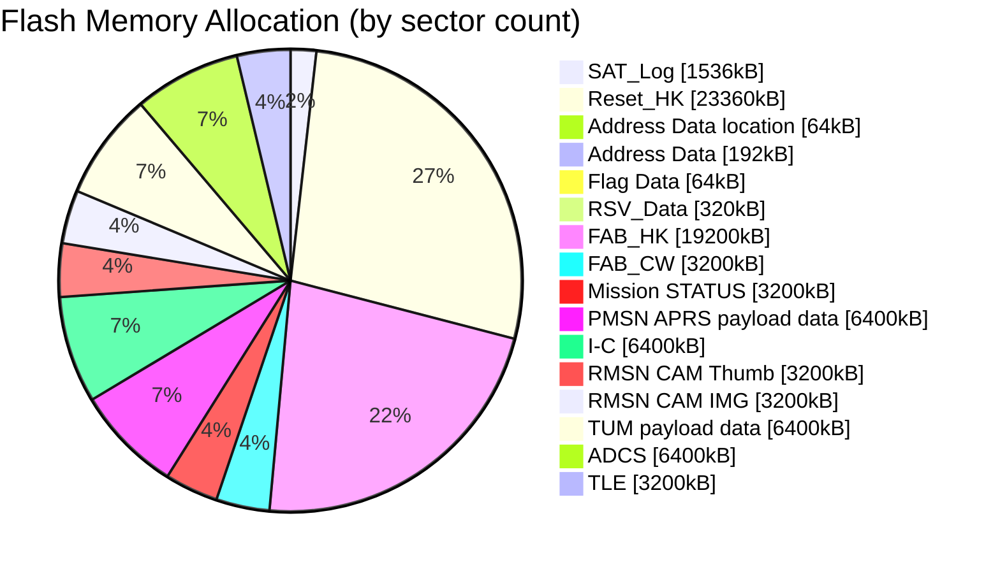

# Flash Memory Guide
**Estimated time to complete:** 8 minutes  
{: .label }

This guide explains the role and structure of flash memory on the OBC (On-Board Computer) board. Flash memory is used to store housekeeping (HK) and mission data from various subsystems, which can later be downlinked to the Ground Station. Communication between the OBC and these memories is handled via **SPI**.

---

## Overview of Flash Memory Usage

Flash memories are shared between the OBC and peripheral subsystems. These are non-volatile memories used for storing telemetry, payload data, configuration states, and communication-related logs.

- **Communication Interface**: SPI
- **Memory Sector Size**: 64 kB
- **Main Partitions**:  
  - **Main FM**: Primary flash for core OBC operations  
  - **Shared Mission FM**: Shared by all mission subsystems  
  - **Shared COM FM**: Shared for communication subsystem needs  

---

## Flash Memory Map Summary

Below is the memory allocation template. Each row describes a type of data, its address range, and the sectors it occupies:

| Data Type             | Address Range       | Sectors | Size (kB) | Used In                |
|----------------------|---------------------|---------|-----------|------------------------|
| SAT_Log              | `0x00000000` - `0x00170000` | 0–23   | 1536      | Main FM, COM FM        |
| Reset_HK             | `0x00190000` - `0x01850000` | 25–389 | 23360     | Main FM                |
| Address Location     | `0x01870000`         | 391     | 64        | Main FM                |
| Address Data         | `0x01880000` - `0x018A0000` | 392–394 | 192      | Main FM                |
| Flag Data            | `0x018B0000`         | 395     | 64        | Main FM                |
| RSV_Data             | `0x018C0000` - `0x01900000` | 396–400 | 320      | Main FM                |
| FAB_HK               | `0x01910000` - `0x02BC0000` | 401–700 | 19200     | Main FM                |
| FAB_CW               | `0x02BD0000` - `0x02EE0000` | 701–750 | 3200      | Main FM                |
| Mission STATUS       | `0x02EF0000` - `0x03200000` | 751–800 | 3200      | Shared Mission FM      |
| PMSN APRS Data       | `0x03210000` - `0x03840000` | 801–900 | 6400      | Main FM, Shared COM FM |
| I-C Data             | `0x03850000` - `0x03E80000` | 901–1000| 6400      | Shared Mission FM      |
| RMSN CAM Thumbnails  | `0x03E90000` - `0x041A0000` | 1001–1050| 3200      | Shared Mission FM      |
| RMSN CAM Images      | `0x041B0000` - `0x044C0000` | 1051–1100| 3200      | Main FM, Shared COM FM |
| TUM Payload Data     | `0x044D0000` - `0x04B00000` | 1101–1200| 6400      | Main FM, Shared COM FM |
| ADCS Data            | `0x04B10000` - `0x05140000` | 1201–1300| 6400      | Main FM                |
| TLE (GPS) Data       | `0x05150000` - `0x05460000` | 1301–1350| 3200      | Main FM, Shared COM FM |

---

## Key Notes

- **Address Location** stores the *starting address* of data logs; this address is updated on boot and overwrites old data.
- **Address Data** contains structured metadata (e.g., flag and HK addresses) used by the OBC firmware.
- **Flag and RSV Data** are used for system state management and reserved operations.
- **Mission Subsystems** (like Paraguay, Moldova, and Rwanda missions) store their payload data in designated shared areas.
- **ADCS & GPS** store telemetry relevant to satellite orientation and positioning.

---

## Best Practices

- **Avoid Overwriting**: Some memory areas (e.g., Address Data, Flag Data) overwrite older content—ensure your firmware handles this safely.
- **Mission Isolation**: When allocating new memory for a mission, ensure no overlap with existing sectors.
- **Clear Sector Mapping**: Always update the sector map and inform team members of changes to avoid conflicts.

---

## Visualization 

Below is an example **memory map diagram** :

