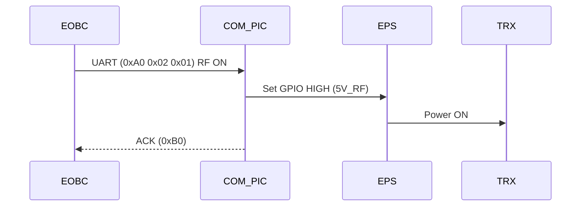

# Reset & COM PIC Communication

**Estimated time to complete:** 7–10 minutes  
{: .label }

This guide explains how the COM PIC is reset, how it communicates with the Main PIC (EOBC), and how it enables power lines for the transceiver and other components. This is essential knowledge for debugging boot issues and understanding startup sequencing.

---

## 🔁 1. Reset Behavior of COM PIC

The COM PIC (Communication PIC) is automatically reset under the following conditions:

- **System startup** (main 5V power supplied)
- **Manual reset** using the external RESET button
- **Software reset** triggered by the EOBC or UART command

> On reset, the COM PIC initializes UART interfaces, sets internal flags, and enables relevant powerlines as part of startup.

---

## 🔌 2. Powering the Powerlines

After reset, the COM PIC powers the necessary EPS (powerlines) using GPIO control:

| Line        | Description                             | Controlled By |
|-------------|-----------------------------------------|---------------|
| `5V_RF`     | Powers the RF front-end / transceiver   | COM PIC GPIO  |
| `3V3_RF`    | Powers logic-level devices on RF board  | COM PIC GPIO  |
| `5V_GPS`    | (If available) powers GPS module        | COM PIC GPIO  |

**Logic sequence:**

```md
On boot → COM PIC sets GPIO HIGH → EPS regulator enables → voltage applied
````

> ⚠️ If no power appears on RF board, check GPIO state using logic analyzer or multimeter.

---

## 📡 3. Communication With Main PIC (EOBC)

COM PIC communicates with the EOBC via UART.

### UART Parameters:

| Parameter | Value         |
| --------- | ------------- |
| Baud rate | 9600 or 19200 |
| Data bits | 8             |
| Stop bits | 1             |
| Parity    | None          |

### Message Structure:

All commands use a 3-byte fixed format:

```text
Byte 1: Start byte (0xA0)
Byte 2: Command ID
Byte 3: Payload/Argument (optional, 0x00–0xFF)
```

#### Example Commands:

| Command       | ID     | Purpose                     |
| ------------- | ------ | --------------------------- |
| Reset COM PIC | `0x00` | Soft-reset from EOBC        |
| Send CW       | `0x01` | Request beacon transmission |
| RF Enable     | `0x02` | Turn on RF module           |

#### Example:

```c
uint8_t cmd[] = { 0xA0, 0x02, 0x01 }; // Turn on RF module
send_uart(COM_UART, cmd, 3);
```

---

## 🔁 4. COM PIC Command Acknowledgement

On receiving a command, the COM PIC may respond with:

* `0xB0` for ACK
* `0xB1` for NACK
* Followed by a status code or data byte

Example:

```text
[0xB0][0x02] → ACK for RF Enable
```

---

## 🗺️ 5. System Flow Diagram



---

## ✅ 6. Summary

* COM PIC resets on startup and enables powerlines
* It uses UART to receive commands from EOBC
* Controls EPS lines via GPIO
* Uses simple 3-byte command structure
* Sends ACK/NACK responses to confirm action

---

## 🧪 7. Useful Debug Tips

| Issue              | Check                          |
| ------------------ | ------------------------------ |
| RF not powering on | Confirm 5V\_RF GPIO high       |
| No ACK response    | Verify UART pins and baud rate |
| Reset loop         | Power instability or brownout  |
| No command effect  | Wrong command ID or byte order |

---

Need more help? Contact your COM PIC lead or refer to the [Command Reference Sheet](/obc/command-list).

```

---

Would you like me to generate a diagram showing GPIO-to-powerline mapping or UART lines between EOBC and COM PIC?
```
