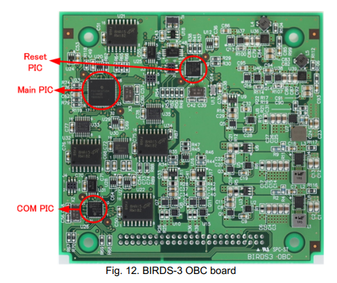
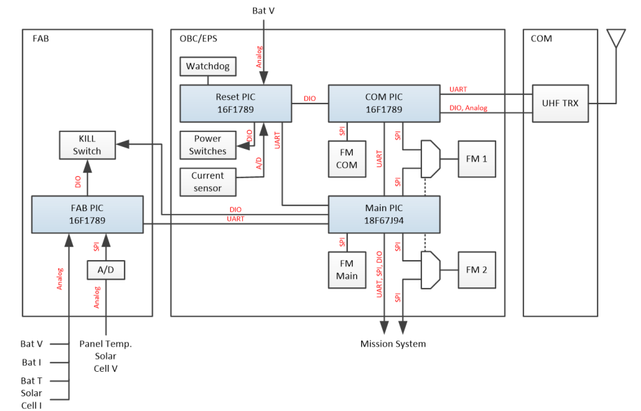

## On Board Computer Board

This is the OBC used in BIRDS 3 and 4. It has three microcontrollers: Main, Reset and Com, all 8 bit PICs. The Main PIC is a PIC18F67J94 and the Reset and Com PICs are PIC16F1789. They are connected as showed in the following diagram:

In short, all PICs (including the one in the FAB) are connected to the main PIC through UART. The Main PIC is in charge of the mission execution (connected through UART, SPI and general IO), voltage regulation and coordinating with the Com PIC when sending and receiving messages. The Reset PIC acts as a dedicated watchdog, listening for answers from the other PICs and resetting them if needed. Finally, the Com PIC is in charge of managing the radio transceiver. This division might seem unnecessary to a point, however it allows easier distribution of work for the team working on a satellite, specially since this bus is meant for didactic use.

An in depth explanation of the functions of this board can be found in the general documentation repo, [***here***](https://github.com/BIRDSOpenSource/BIRDS-GeneralDocumentation).

For the documentation and files related to the OBC itself, please see [***this repo***](https://github.com/BIRDSOpenSource/BIRDS3-OBC). Inside you can find the schematic (not the PCB since it's a proprietary design from Sagami Tsushin), firmware for the three microcontrollers and other files.

[Back](./)
