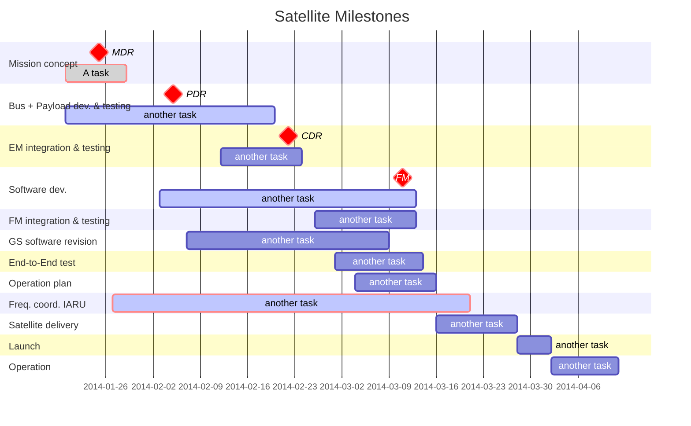

# **Before you start**

Table of Contents

- Table of Contents
{:toc}

## **Introduction**
   This document includes the purpose, structure, and practical steps for using the testing process and procedural guides for most subsystems such as the following: 
   - On-Board Computer (OBC)
   - Electrical Power System (EPS)
   - Attitude Determination and Control System (ADCS)
   - Communications (COM)
   - Structural components of BIRDS satellites

### We are creating an environment for sharing knowledge and ideas.
{: .no_toc }

If you would want to contribute to, or work with the [BIRDS] community to assist in developing this solution, check [our Discussions channel on Github] or [get in touch with us.]

## **The phases of a satellite build**
  The development and deployment of a satellite involve a series of carefully structured phases to ensure the mission's success. From initial concept discussions to final pre-launch verifications, these phases guide teams through designing, building, and testing the satellite to meet stringent space industry standards. 
    
  Each phase acts as a checkpoint to confirm that requirements are met and potential risks are mitigated. The following are the phases of a satellite build:
  1. [Mission Definition Review (MDR)] 
  2. [Preliminary Design Review (PDR)] 
  3. [Critical Design Review (CDR)] 
  4. [Flight Readiness Review (FRR)] 

The satellite phases create a structured pathway from conceptualization to launch, with each review and testing stage serving as a critical checkpoint. The **MDR** sets the scope, the **PDR** checks the initial design feasibility, the **CDR** finalizes the detailed design, and **FRR** ensures that the satellite is robust and mission-ready. This structured approach helps in mitigating risks, ensuring quality, and promoting mission success.

## **Tools used in development**
   - **Software tools**:
     - **Computer Aided Design (CAD) tools for Design**: Fusion 360
     - **Simulation Tools**: Thermal desktop, STK for mission analysis
     - **Programming Languages**: C/C++, Python 
     - **Programming Environment**: CCS Compiler, MPLAB IDE
     - **Communication Protocols**: UART, SPI
   - **Hardware tools**:
     - **Microcontrollers/Boards**: PIC MCUs, custom PCBs
     - **Power Systems**: Solar panels, battery packs
     - **Sensing Devices**: Magnetometers, gyroscopes for ADCS
   - **Version Control**: Git/ [GitHub] 

## [Getting Started]({{site.url}}/get-started){: .btn .btn-purple }

## Other resources
[Engineer Me This](https://www.youtube.com/@EngineerMeThis/videos)
[Build A Cubesat](https://www.youtube.com/@buildacubesat)
[RG Sat](https://www.youtube.com/@RGSAT)
[Kyutech SEIC](https://www.youtube.com/@kyutechseic4187)

----

[GitHub Issues.]: https://github.com/BIRDSOpenSource/Build-A-Satellite/issues
[GitHub]: https://github.com/BIRDSOpenSource
[our Discussions channel on Github]: https://github.com/orgs/BIRDSOpenSource/discussions/categories/ideas
[BIRDS]: https://birds-project.com/
[get in touch with us.]: info@kyutech-laseine.net
[Mission Definition Review (MDR)]: {{site.url}}/project-managers/milestones/pm-mdr.html
[Preliminary Design Review (PDR)]: {{site.url}}/project-managers/milestones/pm-pdr.html
[Critical Design Review (CDR)]: {{site.url}}/project-managers/milestones/pm-cdr.html
[Flight Readiness Review (FRR)]: {{site.url}}/project-managers/milestones/pm-frr.html
