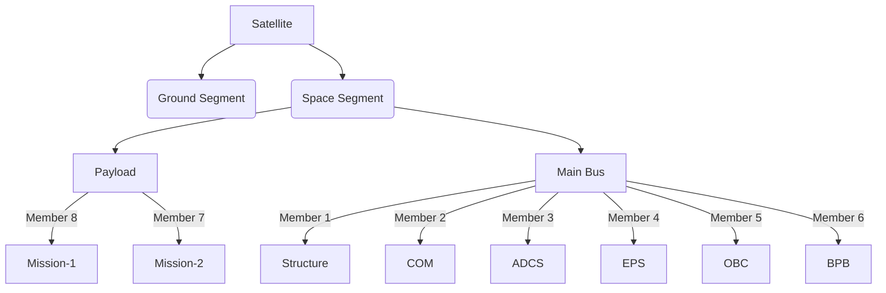

# **The BIRDS Bus**

## **Components of the BIRDS bus**

  
&nbsp;
  

A satellite bus is the main body and structural component of a satellite, where the payload and all scientific instruments are held. The BIRDS bus includes the following key components:

* **On Board Computer (OBC)**: Handles the satellite’s core computing needs.

* **Electrical Power System (EPS)**: Manages power generation, storage, and distribution.

* **Attitude Determination and Control System (ADCS)**: Controls satellite orientation and stability.

* **Communications (COM)**: Oversees data transmission to and from the satellite. 

  
  

    
  
  

* **Structure**: Designs and constructs the satellite’s physical frame.

  
&nbsp;
  

* **Payload**: Manages mission-specific instruments or sensors.

* **Backplane Board (BPB)**: Integrates all the subsystems and allows transfer of power and data to each of them.

         
  

    
  

## *Organizational Chart*
{: .no_toc }

## **The BIRDS Bus**

> **New**: During the March 2022 BIRDS meeting, a team presented their use of the Radiometrix HX1 COM module with the BIRDS platform. The module's datasheet has been added to the COM repository. Also, detailed battery testing and screening procedures have been added to the procedures repository. Please check these new documents.

The BIRDS Bus is one of the main contributions from the BIRDS Project to the working teams. It is a hardware platform that consists mainly of an Electrical Power System (EPS), a Command and Data Handling System (C&DHS) and Communications System (COM) to satisfy the needs of a standard bus. Below is an exploded view of the entire BIRDS Bus:

### Please note:
While this website does contain information regarding the program and the BIRDSBus, the main explanations and documentation is contained in the Program Textbook and the Interface Control Document, which can be found [_here_](https://github.com/BIRDSOpenSource/BIRDS-GeneralDocumentation).

## The BIRDS Bus is comprised of boards, which include the following:

**1. Backplane Board (BPB):**
The backplane is the board that links all other boards together. It has no other component as its only function is to connect all the boards together.
[_More information_]({{site.url}}/overview/birds/bpb-page.html)

**2. Front Access Board (FAB):**
The Front Access Board (FAB) has two main functions, they include:
  * It is the Electrical Power System (EPS) that collects and monitors electrical power information while managing a kill switch. 
  * It houses the external interfaces, such as the 'remove before flight' pins and programming ports. 
  This board is of proprietary design by Sagami Tsushin. As such, only the schematic for this board is included in this documentation, in pdf format.
[_Click here for more information_]({{site.url}}/overview/birds/fab-page.html)

**3. On Board Computer (OBC) / Electrical Power System (EPS):**
Out of the four microcontrollers that the bus has, this board has three of them, which are:
* The Main PIC
* The Reset PIC.
* The Communications PIC. 
Apart from command and data handling, this board also has the function of electrical power distribution which involves regulating the battery inputs. This board is of proprietary design by Sagami Tsushin. As such, only the schematic for this board is included in this documentation, in pdf format.
[_Click here for more information_]({{site.url}}/overview/birds/obc-page.html)

**3. ### Communications Board (COM):**
The Communications Board (COM) has the transceiver module for radio communications. It works on the UHF amateur radio band, in half duplex mode and GMSK modulation, following the AX.25 protocol. This board is also proprietary, provided by Addnics. Another communications board has flown with the bus and has worked. The documentation for this board is included in this release.
[_More information_]({{site.url}}/overview/birds/com-page.html)

**4. Rear Acces Board (RAB):**
Similar to the FAB, the RAB offers connections to several of the bus's interfaces.
[_More information_]({{site.url}}/overview/birds/rab-page.html)

**5. Antenna board:**
This board carries the COM, APRS and GPS antennas as well as their release mechanism.
[_More information_]({{site.url}}/overview/birds/antenna-page.html)

**6. Solar Panel board:**
These boards hold the solar panels that power the satellite.
[_More information_]({{site.url}}/overview/birds/solar-page.html)

### Bus 3D Models:
* The 3D models for the BIRDS3 bus and the stand can be found [_here_](https://github.com/BIRDSOpenSource/BIRDS3-CAD).
* For the BIRDS4 version, check [_here_](https://github.com/BIRDSOpenSource/BIRDS4-CAD)

### Ground Station Software
Information and links to the documentation of the ground station software for the BIRDS satellites can be found [_here_]({{site.url}}/overview/birds/GS-software.html).

[Previous]({{site.url}}./){: .btn .btn-purple }  
[Next]({{site.url}}/get-started/reference.html){: .btn}