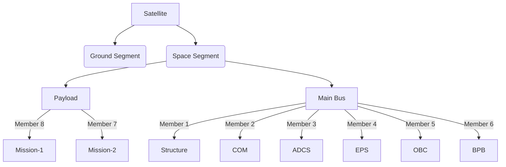

# Explore the BIRDS series

---

---

The Joint Global Multi-Nations Birds Satellite project, or BIRDS project, was created by the Kyushu Institute of Technology ([_Kyutech_](https://www.kyutech.ac.jp/english/)) to help countries build their first satellite. So far, there have been 4 completed and one ongoing BIRDS missions:

1. BIRDS-1: Bangladesh, Japan, Mongolia, Ghana and Nigeria.
2. BIRDS-2: Bhutan, The Philipines and Malaysia.
3. BIRDS-3: Japan, Sri Lanka and Nepal
4. BIRDS-4: Japan, The Philipines, Paraguay.
5. BIRDS-5: Japan, Uganda and Zimbabwe.

The project has two main objectives:

1. Experience the entire cycle of a satellite project, from mission definition to operation, in a hands-on manner.
2. Have a strategy for sustainability after the training ends.

It should be emphasized that the primary goal is not the building of a satellite, but to have a long-term and sustainable space program established in each member country.

Kyutech initiated a long-term fellowship program, DNST/PNST (Doctorate in NanoSatellite Technology/ Postgraduate study in NanoSatellite Technology), in 2011 in collaboration with the United Nations Office of Outer Space Affairs (UNOOSA) to promote the space capacity building of non-space-faring nations. It also started the Space Engineering International Course (SEIC) in 2013 as a postgraduate program.

Two or three young engineers are sent from each participating country to Kyutech as full-time graduate students to learn space engineering using 1U CubeSat development work. The BIRDS program is designed so that each generation of satellites can be finished in two years, from mission definition to operation. Including operation in two years is critical to fit the entire satellite project into a master’s degree course study timeline, which is two years.

# Satellite Bus

## **3. What is in the BIRDS bus?**

  
&nbsp;
  

The bus includes the following key components:

**On-Board Computer (OBC)**: Handles the satellite’s core computing needs.

**Electrical Power System (EPS)**: Manages power generation, storage, and distribution.

**Attitude Determination and Control System (ADCS)**: Controls satellite orientation and stability.

**Communications (COM)**: Oversees data transmission to and from the satellite. 

  
  

    
  
  

**Structure**: Designs and constructs the satellite’s physical frame.

  
&nbsp;
  

**Payload**: Manages mission-specific instruments or sensors.

**Backplane (BPB)**: Integrates all the subsystems and allows transfer of power and data to each of them.

         
  

    
  

## *Organizational Chart*
{: .no_toc }

# The BIRDS Bus

### **New**: A team presented on the March 2022 BIRDS meeting their use of the Radiometrix HX1 COMS module with the BIRDS platform. The module's datasheet has been added to the COMS repos! Also, detailed battery testing and screening procedures have been added to the procedures repo. Please check these new documents.

One of the main contributions from the BIRDS Project to the working teams is the BIRDSBus. It is a hardware platform consisting mainly of an EPS, a C&DHS and COMMS to satisfy the needs of a standard bus. This is an exploded view of the entire bus:

### General documentation:
While this website does contain information regarding the program and the BIRDSBus, the main explanations and documentation is contained in the Program Textbook and the Interface Control Document, which can be found [_here_](https://github.com/BIRDSOpenSource/BIRDS-GeneralDocumentation).

## The boards that comprise the bus are the following:

### Backplane Board (BPB):
The backplane is the board that links all the other ones together. It has basically no other components as its only function is to  connect all the boards together.
[_More information_]({{site.url}}/overview/birds/bpb-page.html)

### Front Access Board (FAB):
The FAB has two main functions. It is the Electrical Power System (EPS), collecting and monitoring electrical power information and managing a kill switch. Also, it contains the external interfaces, such as the remove before flight pins and programming ports. This board is of proprietary design by Sagami Tsushin. As such, only the schematic for this board is included in this documentation, in pdf format.
[_More information_]({{site.url}}/overview/birds/fab-page.html)

### On Board Computer / Electrical Power System (OBC/EPS):
This board has three of the four bus's microcontrollers, being the Main PIC, the Reset PIC and the Communications PIC. Also, apart from command and data handling, this board also has the function of electrical power distribution, regulating the battery inputs. This board is of proprietary design by Sagami Tsushin. As such, only the schematic for this board is included in this documentation, in pdf format.
[_More information_]({{site.url}}/overview/birds/obc-page.html)

### Communications Board (COM):
The COM board has the transceiver module for radio communications. It works on the UHF amateur radio band, in half duplex mode and GMSK modulation, following the AX.25 protocol. This board is also proprietary, provided by Addnics. Another communications board has flown with the bus and has worked. The documentation for this board is included in this release.
[_More information_]({{site.url}}/overview/birds/com-page.html)

### Rear Acces Board (RAB):
Similarly to the FAB, the RAB offers connections to several of the bus's interfaces.
[_More information_]({{site.url}}/overview/birds/rab-page.html)

### Antenna board:
This board carries the COM, APRS and GPS antennas as well as their release mechanism.
[_More information_]({{site.url}}/overview/birds/antenna-page.html)

### Solar Panel board:
These boards hold the solar panels that power the satellite.
[_More information_]({{site.url}}/overview/birds/solar-page.html)

### Bus 3D Models:
The 3D models for the BIRDS3 bus and the stand can be found [_here_](https://github.com/BIRDSOpenSource/BIRDS3-CAD).
For the BIRDS4 version, please find it [_here_](https://github.com/BIRDSOpenSource/BIRDS4-CAD)

### Ground Station Software
Information and links to the documentation of the ground station software for the BIRDS satellites can be found [_here_]({{site.url}}/overview/birds/GS-software.html).

## Documentation Project Team

The effort to release and maintain this documentation to the public is done for Kyutech University by a small team from Costa Rica. The supervising professor, Juan José Rojas, obtained his PhD from the BIRDS Program detailed in the Textbook.

| PhD. Eng. Juan José Rojas Hernández                   |
| :-----------:                                         |
| Researcher                                            |
| _Power Systems and IoT_                               |
| [juan.rojas@tec.ac.cr](mailto:juan.rojas@tec.ac.cr)   |

The documentation, creation of the repositories and this website is done by two assistant students:

| Name                              | Degree                            | Email                             |
|:-------------                     |:------------------                |:------                            |
| Jairo Rodríguez Blanco            | Mecatronics Engineering           | jairo.rb8@estudiantec.cr          |
| Kevin Sánchez Ramírez             | Industrial Engineering            | kevin.sanchezramirez@ucr.ac.cr    |

## Community Telegram Group

A community Telegram group is being formed to discuss questions and other aspects of the BIRDSBus. If you have an interest in joining, use [this link.](https://t.me/+D3BCqCmceQ41ZGFl)

[Previous]({{site.url}}./){: .btn .btn-purple }
[Next]({{site.url}}/get-started/reference.html){: .btn}

